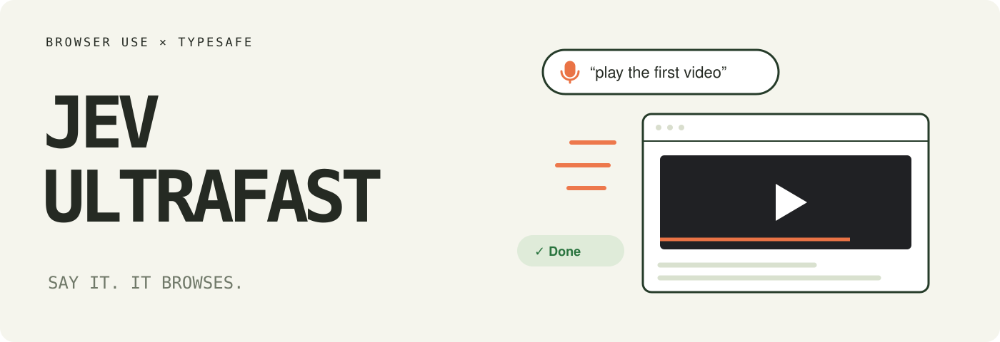
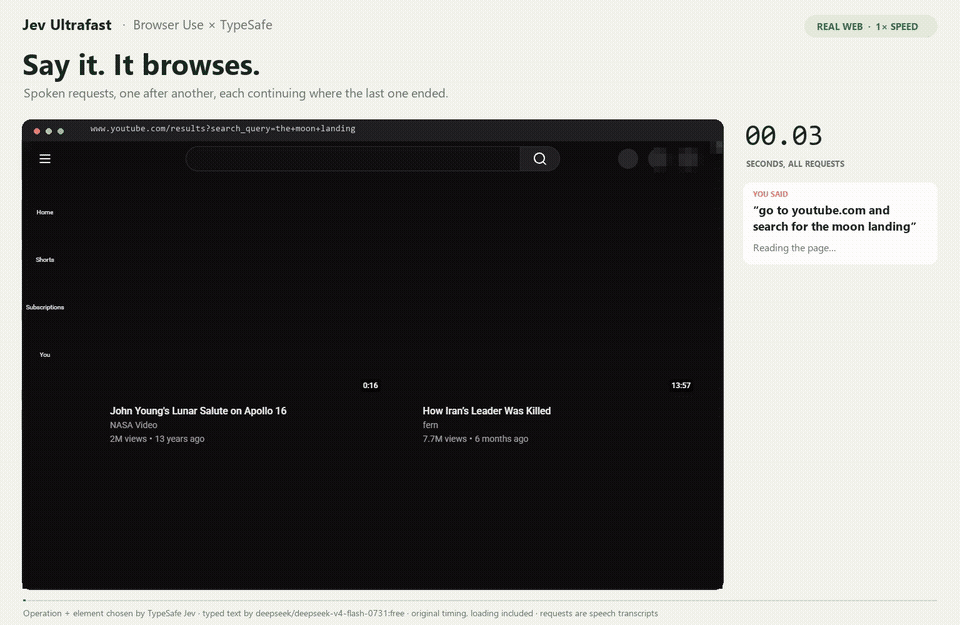
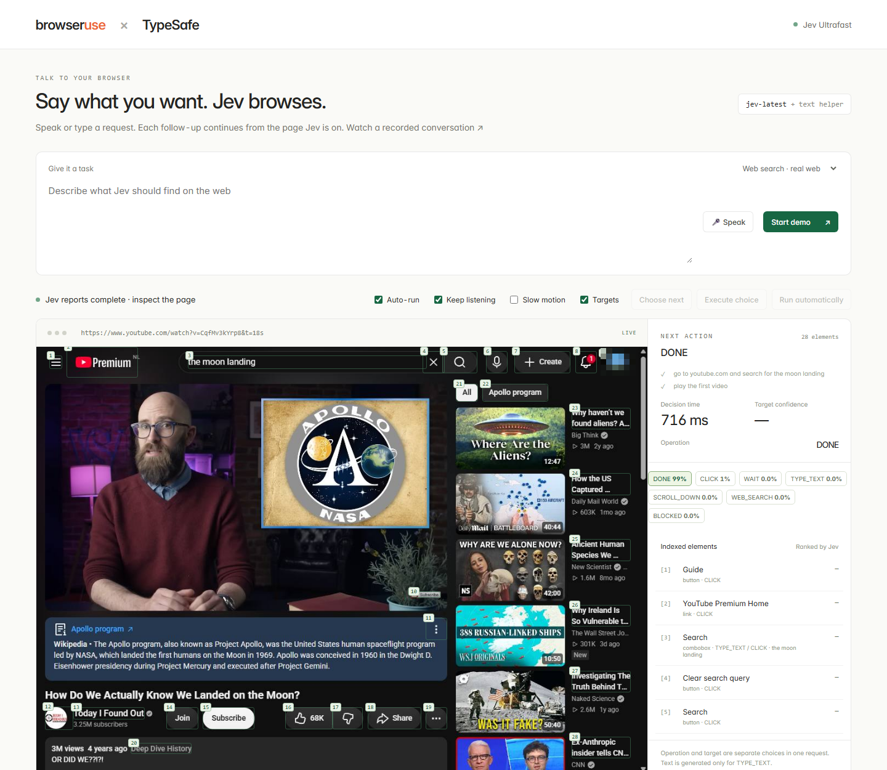

# Jev Ultrafast 🎙️

**Talk to your browser. It clicks, types and scrolls on the real web, one spoken request at a time.**

Say *"go to youtube.com and search for the moon landing"*, then *"play the first video"*, then *"open the channel of this video"*. Each request continues from the page the last one ended on. [TypeSafe's Jev](https://docs.typesafe.ai/introduction) picks every operation and element; a small LLM writes text only when something has to be typed.

<a href="docs/demo.mp4"></a>

[Watch the MP4](docs/demo.mp4) · [Evaluation](docs/evaluation.md) · [Read the loop](jev_ultrafast/agent.py)

> A fork of [browser-use/jev-ultrafast](https://github.com/browser-use/jev-ultrafast), reworked from a single Google Flights demo into a voice-driven, multi-request browser. See [what changed](#what-this-fork-changes).

## How well does it navigate?

**28 of 30 spoken-style requests passed** in three runs of five conversations on live sites: Google, YouTube, Wikipedia, Hacker News and Google Images. Median **4.0 s** per request, including page loads, with a median of **3** decisions.

| Conversation (each line continues from the one before) | Passed | Median |
| --- | --- | --- |
| *“look up the latest news about the war in Yemen”* → *“play the video”* | 3/3 → 2/3 | 4.5 s → 1.9 s |
| *“go to news.ycombinator.com and open the comments of the top story”* | 3/3 | 2.0 s |
| *“go to youtube.com and search for the moon landing”* → *“play the first video”* → *“open the channel of this video”* | 3/3 → 3/3 → 2/3 | 4.5 s → 2.1 s → 3.0 s |
| *“find the Wikipedia article about the Eiffel Tower”* → *“now open the article about the man who designed it”* | 3/3 → 3/3 | 6.5 s → 1.6 s |
| *“look up a picture of a cow”* → *“show me sheep instead”* | 3/3 → 3/3 | 5.4 s → 4.0 s |

The two misses: Al Jazeera's live player never rendered a video in Jev's tab, and once Jev kept clicking a YouTube recommendation filter instead of the channel link. Both ended as `blocked`, not as a false success. Three runs of ten requests is a sanity check, not a benchmark, and live sites change daily.

Every request is checked on the final page by code that knows nothing about Jev's choices (a URL, a playing `<video>`, the story that was first on the front page). A `DONE` from Jev is never counted as a pass. Details, every run, and every failure: [docs/evaluation.md](docs/evaluation.md).

## Try it

```bash
git clone https://github.com/Espaye/jev-ultrafast.git
cd jev-ultrafast
uv sync
cp .env.example .env
# Add TYPESAFE_API_KEY and TEXT_MODEL_API_KEY.
uv run jev
```

Open **http://127.0.0.1:8766** in Chrome, click **🎤 Speak**, and say what you want. Tick **Keep listening** to hold a conversation: the mic reopens after each spoken answer ("Done in 3 seconds.") until you say *"stop"*. Typing a request works the same way.

- A request that names a site (*"open news.ycombinator.com"*) opens it. Otherwise Jev starts from a Google search; it cannot use the address bar.
- Follow-ups (*"play the video"*, *"open its channel"*) continue in Jev's tab, with earlier requests as context.
- The inspector shows the numbered elements Jev saw, its operation and target probabilities, and every executed action. **Choose next** pauses before each action.

Chrome connects through [Browser Harness](https://github.com/browser-use/browser-harness), installed by `uv sync`. Run `uv run browser-harness --doctor` if it needs connecting, and allow remote debugging when Chrome asks. Jev works in its own background tab of your Chrome profile, so your logins and extensions apply (a site blocker will block Jev too).

`TEXT_MODEL_API_KEY` is an OpenRouter key in the example configuration. Any OpenAI-compatible endpoint works; set the model, endpoint and reasoning setting in `.env`.



## How it works

Every observation of the page becomes a fresh, numbered element table:

```text
[1] button    Guide
[2] searchbox Search                 · moon landing
[3] link      How Do We Actually Know We Landed on the Moon?
...
```

One TypeSafe request answers two questions at once: which **operation** (`CLICK`, `TYPE_TEXT`, `SELECT`, `SCROLL_UP`, `SCROLL_DOWN`, `WAIT`, `WEB_SEARCH`, `DONE`, `BLOCKED`) and which **element** for each operation that needs one. Only the head matching the chosen operation can execute. When the operation is `TYPE_TEXT`, a small LLM writes the value from the request.

```text
spoken request ─→ transcript ─→ goal (+ earlier requests as context)
                                   │
page ─→ element table ─→ one TypeSafe request ─→ operation + element
                                   │
               CLICK [3] ──────────┼──→ browser ─→ observe again
           TYPE_TEXT [2] ─→ small LLM ─→ text ─┘
```

Model output never becomes selectors, coordinates, URLs or code. Every target is an observed DOM node; the executor rechecks that the page has not changed and that nothing covers the element before input. `WEB_SEARCH` goes to a fixed Google address owned by code.

## What this fork changes

| | |
| --- | --- |
| **Voice + conversations** | Chrome speech recognition fills the request; spoken answers; follow-ups continue in the same tab with earlier requests as context. |
| **Any website** | Start on a site named in the request or on a Google search; `WEB_SEARCH` lets Jev leave a page that cannot help. |
| **Modern pages** | Waits for single-page apps that change the URL without a new document (nos.nl, YouTube), follows links that open a new tab, names images, videos and embedded players so "play the video" has visible evidence. |
| **No more loops** | Fixed a homepage ↔ article bounce and a Pause ↔ Play toggle; a request that repeats the same action from the same page three times now stops as blocked. |
| **Honest evaluation** | [`scripts/conversations.py`](scripts/conversations.py) runs spoken-style conversations and checks every request independently. |

## Use the library

```python
from jev_ultrafast import Agent

with Agent("https://www.youtube.com", "search for the moon landing", web_search=True) as agent:
    for state in agent.run():
        print(state["elapsed_ms"], state["status"])
    agent.new_task("play the first video")  # continues in the same tab
    for state in agent.run():
        print(state["elapsed_ms"], state["status"])
```

Run with `uv run --env-file .env python your_script.py`, or try a single request:

```bash
uv run --env-file .env python examples/run.py \
  --url https://en.wikipedia.org/wiki/Main_Page \
  --goal 'Open the Wikipedia article about Gödel’s incompleteness theorems.'
```

## Small enough to read

| File | Job |
| --- | --- |
| [agent.py](jev_ultrafast/agent.py) | The loop, follow-up requests, loop detection, text-helper handoff |
| [snapshot.js](jev_ultrafast/snapshot.js) | Atomic DOM snapshot, indexed controls, media, freshness guards |
| [browser.py](jev_ultrafast/browser.py) | Browser connection, navigation waits, new tabs, execution |
| [model.py](jev_ultrafast/model.py) | Dynamic operation/target heads and text generation |
| [questions.py](jev_ultrafast/questions.py) | Model instructions |
| [demo.py](jev_ultrafast/demo.py), [app.js](jev_ultrafast/static/app.js) | Local inspector with voice |

## Limits

- Speech recognition is Chrome's; the evaluation feeds transcripts as text, so it measures browsing, not hearing. Anything the mic picks up becomes a request.
- A `DONE` can be wrong: in two development runs Jev typed "cow", clicked Google's Images link instead of searching, and reported done on an empty page. Check outcomes that matter.
- The loop guard stops the same action repeated from a page that looks the same. It does not catch a control that changes the page on every click (a filter toggled back and forth); the step budget and the model's own `BLOCKED` still end those.
- The DOM reader handles common HTML and ARIA controls. Shadow roots, cross-origin frames (Jev sees an embedded player but cannot click inside it), canvas, uploads and drag-and-drop are out of scope.
- Jev's tab shares your Chrome profile: logins, cookies and extensions apply.

## Development

```bash
uv run ruff check .
uv run pytest
node --check jev_ultrafast/static/app.js
node --check jev_ultrafast/snapshot.js
uv build
```

Tests are offline. `uv run python scripts/check_guards.py` checks real controls in a local browser without model calls. `scripts/conversations.py` and `examples/` make paid model calls; `scripts/conversations.py <folder> --only youtube --record` captures a screencast that `scripts/render_conversation.py <folder>` renders at 1× into `docs/demo.mp4` and `docs/demo.gif`. Credentials and raw traces stay ignored.

---

[Browser Use](https://github.com/browser-use/browser-use) · [Browser Harness](https://github.com/browser-use/browser-harness) · [TypeSafe](https://docs.typesafe.ai/introduction) · [Upstream repo](https://github.com/browser-use/jev-ultrafast)
